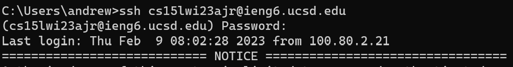
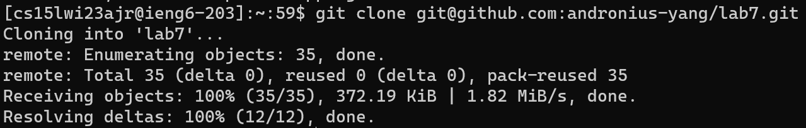
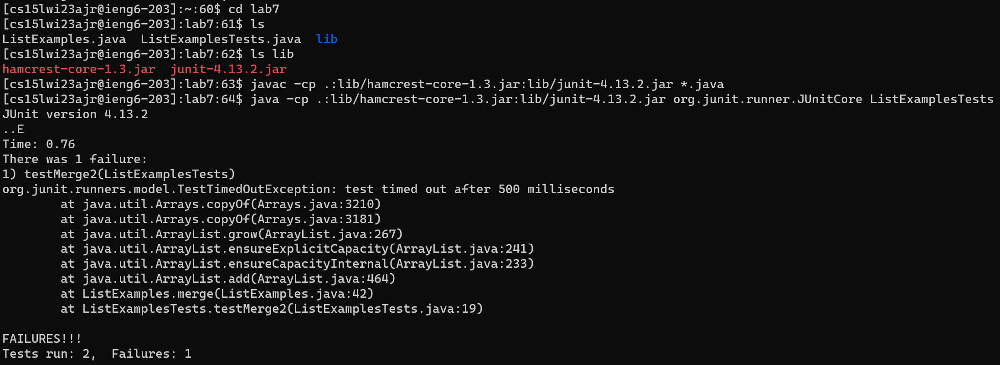
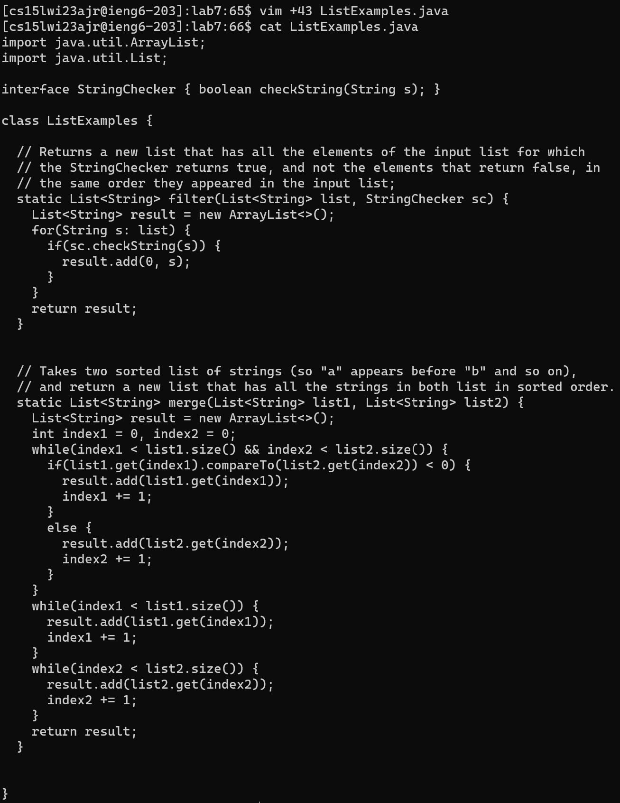
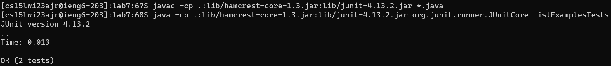
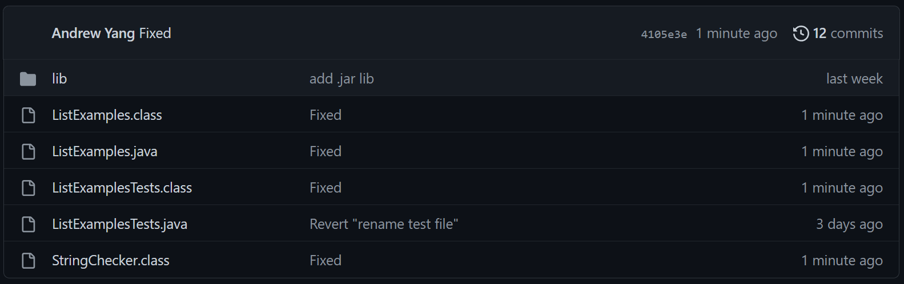

# CSE 15L Blog
## Lab Report 4
### Author: Andrew Yang
## Step 4

The inputs are:

`ssh cs15lwi23ajr@ieng6.ucsd.edu<enter>`

`<password><enter>`
## Step 5

The inputs are:

`git clone git@github.com:andronius-yang/lab7.git<enter>`
## Step 6

The inputs are:

`cd lab7<enter>`

`ls<enter>`

`ls lib<enter>`

`javac -cp .:lib/hamcrest-core-1.3.jar:lib/junit-4.13.2.jar *.java<enter>`

`java -cp .:lib/hamcrest-core-1.3.jar:lib/junit-4.13.2.jar org.junit.runner.JUnitCore L<tab>T<tab><bksp><enter>`
## Step 7

The inputs are:

`vim +43 L<tab>.java<enter>`

`l<*6> i <bksp> 2 <esc> :wq`

To demonstrate that I successfully edited the file, I displayed its contents.

`cat L<tab>.java<enter>`
## Step 8

The inputs are:

`<up*4 (since the previous compile command was 4 commands previous)><enter>`

`<up*4><enter>`
## Step 9

The inputs are:

`git add .<enter>`

`git commit -m "Fixed"<enter>`

`git push<enter>`

The following commit can be seen on GitHub:
